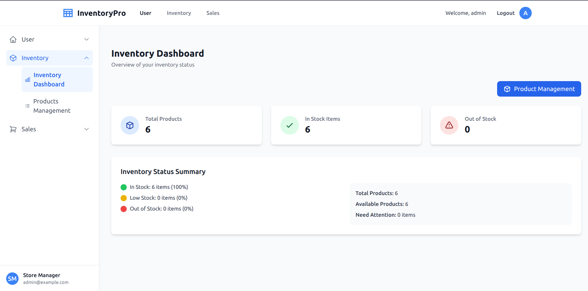
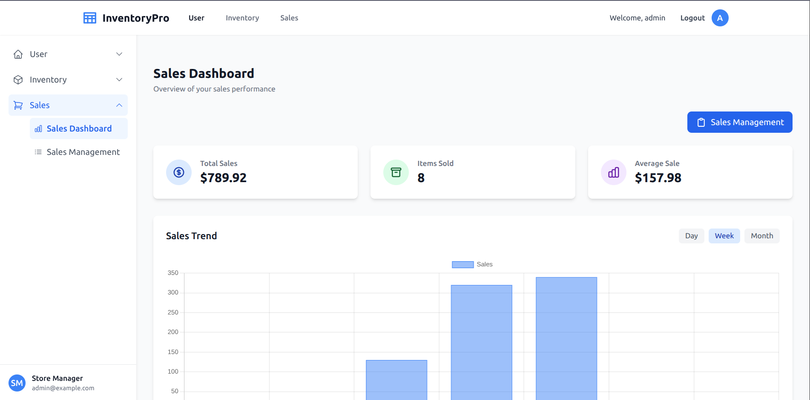

# Inventory Management System

A modern, responsive inventory and sales management application built with React and Tailwind CSS.

<p align="center">  </p>

## Features

### Role-Based Access Control

- **Admin**: Full access to all dashboards (User, Inventory, Sales)
- **Sales Staff**: Access to Sales dashboard only
- **Inventory Staff**: Access to Inventory dashboard only

### Inventory Management

- Real-time inventory tracking
- Low stock alerts
- Product management (add, edit, delete)
- Inventory dashboard with key metrics

### Sales Management

- Sales history tracking
- Sales analytics and reporting
- Add new sales records

## Quick Start

1. Clone the repository
2. Install dependencies:
   ```
   cd inventory-app/frontend
   npm install
   ```
3. Start the development server:
   ```
   npm run dev
   ```
4. Open your browser and navigate to `http://localhost:5173`

## Demo Login Credentials

For testing purposes, you can use the following credentials:

- **Admin**: admin@example.com / password
- **Sales**: sales@example.com / password
- **Inventory**: inventory@example.com / password

## Screenshots

<p align="center">  </p>

<p align="center">  </p>

<p align="center">  </p>

## Technologies Used

- React
- React Router
- Tailwind CSS
- Context API for state management

## Project Structure

```
frontend/
├── src/
│   ├── assets/         # Images and static assets
│   ├── components/     # Reusable UI components
│   ├── context/        # Context providers (Auth, etc.)
│   ├── data/           # Mock data for development
│   ├── pages/          # Page components
│   └── App.jsx         # Main application component
├── index.html
└── package.json
```

## License

[Your License]
